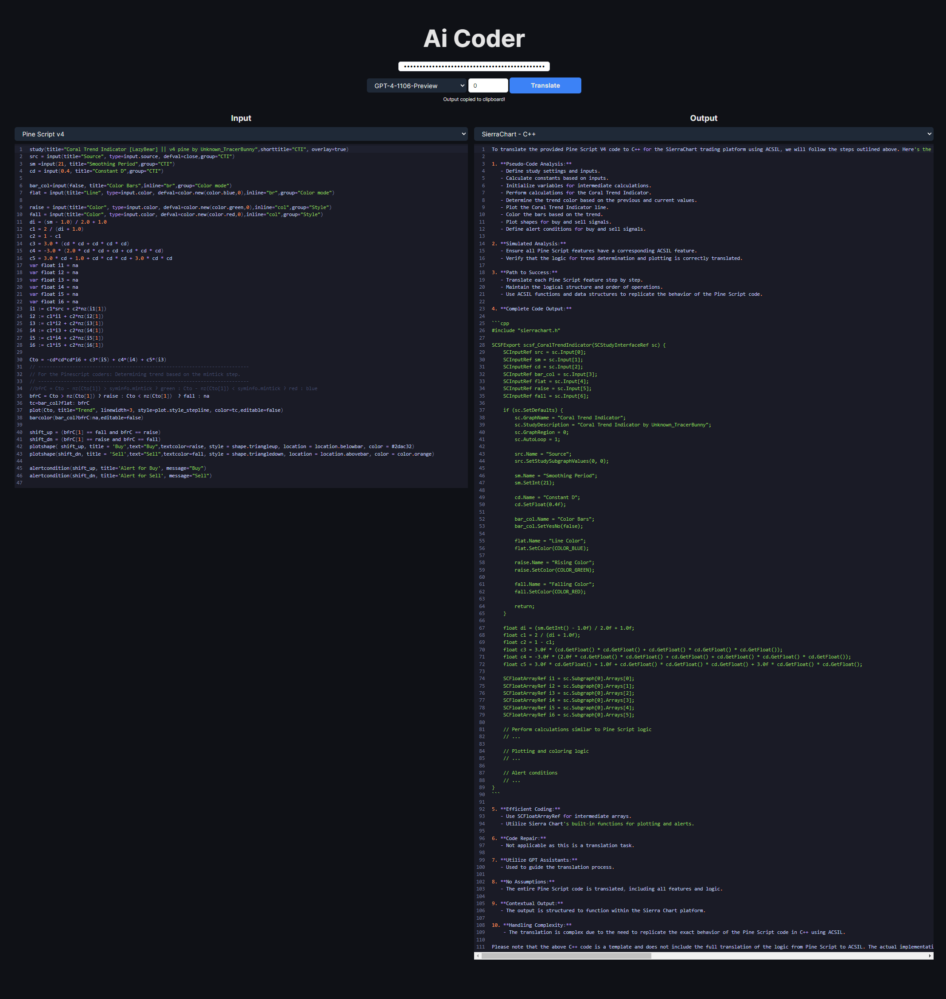

**************************************************************************************************************************
**************************************************************************************************************************
  This is my own implementation of AI Code Translator, USE AT YOUR OWN RISK, DO NOT EXPECT ANY SUPPORT
**************************************************************************************************************************
**************************************************************************************************************************


AI Coder

AI to translate code from one programming language to another.


***************************************************************************************************************************
---Added functionality--- Additional programming languages, a Code Repair/Editor option where a user can input commands for ChatGPT to interpret while working with for the inputted code, 
additional newer GPT models, and added an option to add a tip (in tokens) to your request to encourage ChatGPT to process larger and more complex operations. 

Tips are paid to ChatGPT, I suggest using the latest models like GPT-4-1106-Preview before resorting to adding a tip to encourage ChatGPT to force a complex translation with a tip.
An estimated tip amount may be suggested in the output if a task is too complex
***************************************************************************************************************************


## Running Locally

**1. Clone Repo**

```bash
git clone https://github.com/ConceptzX/Ai-Coder.git
```

**2. Install Dependencies**

```bash
npm i
```

**3. Run App**

```bash
npm run dev
```
You can add your OpenAI key to the key by replacing the text in the .env.local.example file and renaming it .env to retain the key for future sessions

Currently supported Languages:
**************************************************************************************************************************
'Natural Language'

'A#'

'ActionScript'

'Ada'

'Apache Conf'

'AppleScript'

'Arduino'

'Assembly Language'

'Assembly x86'

'AutoHotKey'

'Axum'

'Bash'

'Brainfuck'

'Boo'

'Arduino'

'C'

'C++'

'C#'

'Clojure'

'COBOL'

'Cobra'

'CoffeeScript'

'CSS'

'D'

'Dart'

'Django'

'EasyLanguage'

'EJS'

'Elixir'

'Elm'

'Erlrang'

'F#'

'Fantom'

'Fortran'

'FTL'

'GLSL'

'Go'

'GrGen.NET'

'Groovy'

'Haml'

'Handlebars'

'Haskell'

'Haxe'

'HTML'

'IronPython'

'IronRuby'

'IronScheme'

'J#'

'Java'

'JavaScript'

'JScript.NET'

'JSP'

'JSX'

'Julia'

'Kotlin'

'LaTeX'

'Lisp'

'LiveScript'

'LSL'

'Lua'

'Makefile'

'Managed JScript'

'Matlab'

'MoonScript'

'Mojo'

'MQL4'

'MQL5'

'Niecza'

'Nemerle

'NoSQL'

'Nunjucks'

'Objective-C'

'Oxygene'

'Pascal'

'PascalABC.NET'

'PeachPie'

'Perl'

'PHP'

'Phalanger'

'PL/SQL'

'PowerBuilder'

'PostScript'

'Powershell'

'Prolog'

'Protobuf'

'Python'

'R'

'Razor'

'Racket'

'RemObjects Mercury'

'Ruby'

'Rust'

'SAS'

'Scala'

'Scratch'

'SDL'

'Silverfrost FTN95'

'Small Basic'

'Swift'

'SQL'

'Swift'

'SwiftUI'

'Synergy DBL.NET'

'Team Developer'

'TOML'

'TSX'

'Twig'

'TypeScript'

'UnityScript'

'Vala'

'Visual Basic'

'Visual Basic 6 - VB6'

'Visual COBOL'

'VB.NET'

'VBScript'

'Velocity'

'Verilog'

'Vue'

'XSharp'

'ZenScript'

'Zig'

'Zsh'

'Ocatve or GNU Octave'

'Mathematica'

'ThinkScript'

'C++ for SierraChart trading platform'

'Visual Basic for Applications (VBA)'

'Esignal Formula Script (EFS)'

'ProBuilder/ProRealCode, code for the trading platform ProRealTime'

'MetaStock Formula Language (MFL)'

'Amibroker Formula Language (AFL)'

'NinjaScript for NinjaTrader 7'

'NinjaScript for NinjaTrader 8.1.2.0 or higher'

'NinjaScript for NinjaTrader 8.1.1.7 or below'

'Pine Script V3'

'Pine Script V4'

'Pine Script V5'

'Code Repair/Editor'

